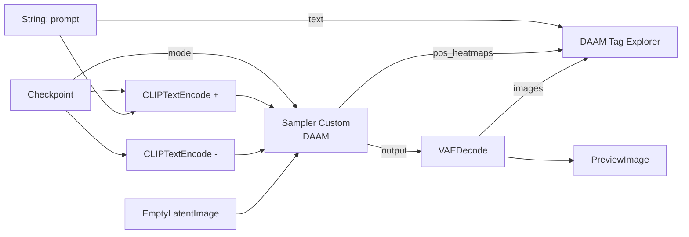

# ComfyUI-DAAM-Pack

[English](README.md) | [한국어](README_ko.md)

A [ComfyUI](https://github.com/comfyanonymous/ComfyUI) custom node pack that visualizes **which prompt tag shaped which part of the image**, via cross-attention heatmaps ([DAAM](https://arxiv.org/abs/2210.04885)).

## Installation

### ComfyUI Manager

Search for **ComfyUI-DAAM-Pack** in the Manager and install it.

### Manual

```bash
cd ComfyUI/custom_nodes
git clone https://github.com/alchemine/comfyui-daam-pack
```

Then restart ComfyUI. No extra Python dependencies — `numpy`, `torch` and `Pillow` already ship with ComfyUI.

## Requirements

- ComfyUI (recent frontend)
- SDXL-family checkpoints (heatmaps are collected on the image/16 cross-attention grid)

## Example

<video src="https://github.com/alchemine/comfyui-daam-pack/raw/main/assets/comfyui-daam-pack-example-v1.0.0.mp4"
       controls muted loop width="900">
  <a href="https://github.com/alchemine/comfyui-daam-pack/raw/main/assets/comfyui-daam-pack-example-v1.0.0.mp4">Watch the demo</a>
</video>

[`workflows/comfyui-daam-pack-workflow.json`](workflows/comfyui-daam-pack-workflow.json) is a minimal SDXL graph: drag it onto the
canvas, pick a checkpoint, and queue it.



Building it by hand is three changes to a normal `SamplerCustom` graph:

1. Swap `SamplerCustom` for **Sampler Custom (DAAM)** — same inputs, two extra heat map outputs.
2. Feed the prompt from a **string node** into *both* `CLIPTextEncode` and the explorer, so the two
   see the exact same text. Different text means the tag indices will not line up.
3. Wire **DAAM Tag Explorer**: `clip`, that prompt string, `pos_heatmaps`, and the decoded `images`.

Queue the prompt, then hover the image inside the explorer node.

## Provided Nodes (`DaamPack/DAAM`)

| Node | Description |
|------|-------------|
| **Sampler Custom (DAAM)** | Drop-in replacement for `SamplerCustom` that also captures cross-attention heatmaps (`pos_heatmaps` / `neg_heatmaps`). With no heatmap output connected the attention patch is skipped entirely, so it costs exactly what the stock sampler costs. |
| **DAAM Tag Explorer** | Interactive per-tag attention viewer. Splits the prompt into comma-separated tags (BREAK chunks and `embedding:name` handled) and renders them against the heatmaps. |

### Sampler Custom (DAAM)

- **Input**: same as `SamplerCustom` (`model`, `add_noise`, `noise_seed`, `cfg`, `positive`, `negative`, `sampler`, `sigmas`, `latent_image`)
- **Output**: `output`, `denoised_output`, `pos_heatmaps`, `neg_heatmaps`
- Heatmaps are accumulated on the GPU and stored on the image/16 grid — exactly the finest cross-attention resolution of SDXL — then averaged over all layers and steps.

### DAAM Tag Explorer

- **Input**: `clip`, `text` (the same prompt string that was encoded, BREAK included), `heatmaps` (from Sampler Custom (DAAM)), `images` (decoded)
- **Interaction**:
  - Hover the image: a live bar chart shows each tag's share of the attention under the cursor (blue > 2/N, yellow > 1/N of an even split over N tags)
  - Click the image: selects the tag dominating that spot
  - Point at a tag in the panel: overlays its heatmap while the pointer rests there, leaving whatever is pinned untouched
  - Click tags in the panel: pins them (jet colormap with a colorbar). Several pinned tags are combined cell by cell with a max, not a mean: two tags rarely look at the same place, so averaging would cap the result near 1/N and turn everything cold. Each tag keeps the scale it had alone, so the colorbar means the same thing however many are pinned
  - Arrow keys: walk the list, previewing each tag as you go (the widget takes focus on pointer-enter, so no click first); `Enter` or `Space` pins the one under the cursor, `Escape` clears the preview
  - `strength` / `smooth` sliders
  - `view: heatmap` / `view: mask` button under `smooth`: mask mode drops the jet colours and lets the map be the picture's own visibility instead — 1 leaves the render untouched, 0 goes black — which shows what the tag looked at in the render's own pixels. The map runs through a logistic curve first (steepness 10 about the midpoint, ends pinned to 0 and 1 by an affine rescale): a linear ramp leaves most of the frame in a flat mid grey, while the S-curve drops the cold half away quickly and returns the warm half to the render. `strength` works in both views: overlay opacity for the jet map, how far the cold half is allowed to darken for the mask. At 0 either one leaves the render untouched. The slider keeps one value per view (0.5 for the overlay, 1.0 for the mask) and swaps them when you toggle, since neither default suits the other.
- **Idle bars: did this tag give the picture a shape?** Two readings over the tag's own map, and a tag counts by whichever it does better on:
  - **sharpness** — mean |z| over the strongest 1% of cells, in sigma. Favours the small and deep (an eye). On the z-scored map so the large positive baseline every attention map carries drops out; absolute so carving a dark region counts as much as lighting a bright one (attention is non-negative, so a deep hole and a tall peak are mutually exclusive); over 1% rather than the single peak so a tag that landed on both arms is not scored below one that landed on a single arm.
  - **separation** — Otsu's between-class variance ratio. Scale free, so it credits the large and cleanly bounded (a body) where a peak reading fails.
  - Neither ranks tags fairly alone, and that is structural: z-scoring fixes each map's total energy, so peak height and spread area are two ends of one seesaw. Sharpness puts `jitome` first and `nude` near the bottom; separation reverses them.
  - Each reading is scored against a **fixed floor and ceiling** (3.5–8 sigma, 0.68–0.80), calibrated on 222 tags over six renders, and the bar is the better of the two credits. So the 0..1 number is absolute: a prompt where nothing goes blue really did build nothing, and two renders compare tag for tag. Ranking tags against each other instead would paint a third of every prompt blue whatever it did, saying nothing the sort order does not already say.
  - Rows are sorted by it. Whether a map sits in the *right* place is a different question again, and no unsupervised statistic over the map alone can see it.
- The maps travel to the browser as one small `.npy` per image, so all interaction runs client-side.
- The `text` input must be the exact string the conditioning was encoded from (feed both from the same upstream node), or the tag indices will not line up.

## License

GPL-3.0 — see [LICENSE](LICENSE).
