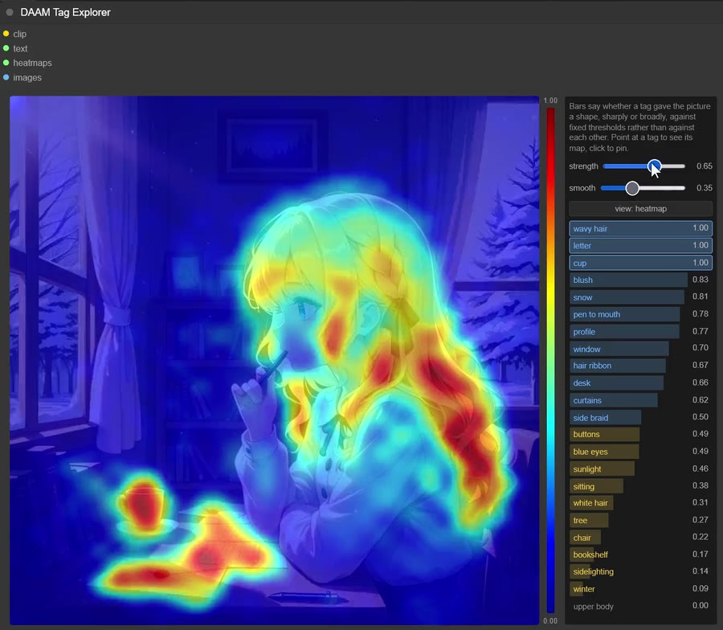

# ComfyUI-DAAM-Pack

[English](README.md) | [한국어](README_ko.md)

See which prompt tag shaped which part of the image, via cross-attention heatmaps ([DAAM](https://arxiv.org/abs/2210.04885)). SDXL only.

[](https://github.com/alchemine/comfyui-daam-pack/blob/main/assets/comfyui-daam-pack-example-v1.0.0.mp4)

*[▶ Demo](https://github.com/alchemine/comfyui-daam-pack/blob/main/assets/comfyui-daam-pack-example-v1.0.0.mp4) (34s)*

## Installation

Search for **ComfyUI-DAAM-Pack** in ComfyUI Manager, or:

```bash
cd ComfyUI/custom_nodes
git clone https://github.com/alchemine/comfyui-daam-pack
```

## Example

[`workflows/comfyui-daam-pack-workflow.json`](workflows/comfyui-daam-pack-workflow.json)


## Nodes (`DaamPack/DAAM`)

### Sampler Custom (DAAM)

`SamplerCustom` plus two heatmap outputs. Leave them unconnected and it costs what `SamplerCustom` costs.

| Input | Description |
|-------|-------------|
| same as `SamplerCustom` | `model`, `add_noise`, `noise_seed`, `cfg`, `positive`, `negative`, `sampler`, `sigmas`, `latent_image` |

| Output | Description |
|--------|-------------|
| `output`, `denoised_output` | Same as `SamplerCustom` |
| `pos_heatmaps` / `neg_heatmaps` | Per-token attention maps, for the explorer |

### DAAM Tag Explorer

| Input | Description |
|-------|-------------|
| `clip` | The CLIP that encoded the prompt |
| `text` | The prompt string, BREAK included. Must be the exact string the conditioning was encoded from — feed both from the same node, or the tags will not line up |
| `heatmaps` | `pos_heatmaps` from Sampler Custom (DAAM) |
| `images` | The decoded images |

| Control | Description |
|---------|-------------|
| Hover the image | Bars show each tag's share of the attention at that point. Blue is over 2/N, yellow over 1/N, for N tags |
| Click the image | Selects the tag that dominates that spot. Ctrl/Shift-click adds to the selection |
| Point at a tag | Shows its map while the pointer rests there |
| Click a tag | Pins it. Several pinned tags show at once, each at its own scale |
| Arrow keys | Walk the list. `Enter` / `Space` pins, `Escape` clears |
| `strength` | How strongly the map is applied. 0 leaves the render untouched |
| `smooth` | Blurs the map before it is drawn. 0 shows the raw attention cells |
| `view: heatmap` | Jet colours over the image, 0 to 1 on the colorbar |
| `view: mask` | The map becomes the image's visibility instead: what the tag looked at stays lit, the rest goes dark |

Bars with the pointer off the image are a 0-to-1 score for **whether the tag gave the picture a shape** — a sharp peak or a cleanly bounded region both count. The scale is fixed, not relative to the other tags, so a prompt where nothing scores high really did build nothing. Rows are sorted by it.

## License

GPL-3.0 — see [LICENSE](LICENSE).
