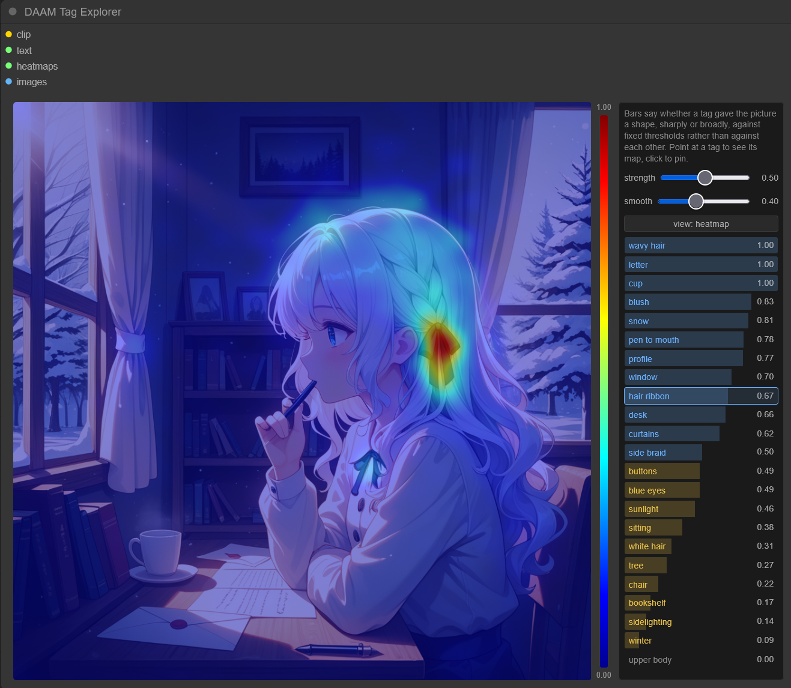

# ComfyUI-DAAM-Pack

[English](README.md) | [한국어](README_ko.md)

https://github.com/user-attachments/assets/9903ff79-d4fa-459b-bf72-b7c09f0b21f6



See which prompt tag shaped which part of the image, via cross-attention heatmaps ([DAAM](https://arxiv.org/abs/2210.04885)).

> [!IMPORTANT]
> **SDXL only.** The heatmaps are read out of the UNet's cross-attention blocks, which DiT models — Flux, SD3, Qwen-Image, Wan — do not have.

## Usage

Everything happens inside the **DAAM Tag Explorer** node, between the image on the left and the tag list on the right.

| Do this | Get this |
|---------|----------|
| **Hover the image** | Each tag's bar shows its share of the attention at that pixel. Blue is over 2/N, yellow over 1/N, for N tags |
| **Click the image** | Selects the tag that dominates that pixel. Ctrl/Shift-click adds it to the selection instead of replacing it |
| **Hover a tag** | Shows that tag's map while the pointer rests on it |
| **Click a tag** | Pins it. Click more to pin several — they show at once, each at its own scale |
| **Arrow keys** | Walk the list. `Enter` / `Space` pins, `Escape` clears |

With the pointer off the image, the bars turn into a 0-to-1 score for **whether the tag gave the picture a shape** — a sharp peak or a cleanly bounded region both count. The scale is fixed rather than relative to the other tags, so a prompt where nothing scores high really did build nothing. Rows are sorted by it.

| Control | What it does |
|---------|--------------|
| `strength` | How strongly the map is applied. 0 leaves the render untouched |
| `smooth` | Blurs the map before it is drawn. 0 shows the raw attention cells |
| `view: heatmap` | Jet colours over the image, 0 to 1 on the colorbar |
| `view: mask` | The map becomes the image's visibility instead: what the tag looked at stays lit, the rest goes dark |

## Example

[`workflows/comfyui-daam-pack-workflow.json`](workflows/comfyui-daam-pack-workflow.json)


## Installation

Search for **ComfyUI-DAAM-Pack** in ComfyUI Manager, or:

```bash
cd ComfyUI/custom_nodes
git clone https://github.com/alchemine/comfyui-daam-pack
```

## Nodes (`DaamPack/DAAM`)

**Sampler Custom (DAAM)** — `SamplerCustom` plus `pos_heatmaps` / `neg_heatmaps`, the per-token attention maps. Leave them unconnected and it costs what `SamplerCustom` costs.

**DAAM Tag Explorer** — the viewer above.

| Input | Description |
|-------|-------------|
| `clip` | The CLIP that encoded the prompt |
| `text` | The prompt string, BREAK included. Must be the exact string the conditioning was encoded from — feed both from the same node, or the tags will not line up |
| `heatmaps` | `pos_heatmaps` from Sampler Custom (DAAM) |
| `images` | The decoded images |

## License

GPL-3.0 — see [LICENSE](LICENSE).
