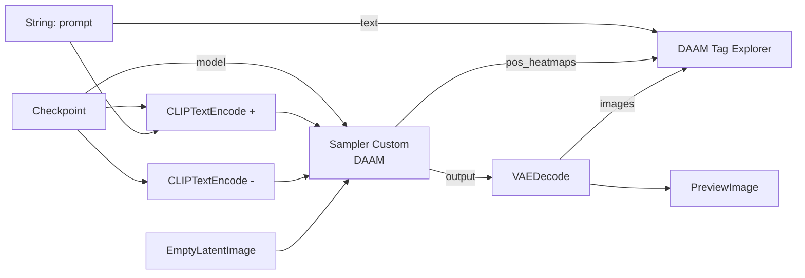

# ComfyUI-DAAM-Pack

[English](README.md) | [한국어](README_ko.md)

크로스 어텐션 히트맵([DAAM](https://arxiv.org/abs/2210.04885))으로 **프롬프트의 어떤 태그가 이미지의 어느 부분을 만들었는지** 시각화하는 [ComfyUI](https://github.com/comfyanonymous/ComfyUI) 커스텀 노드 팩입니다.

## 설치

### ComfyUI Manager

Manager에서 **ComfyUI-DAAM-Pack**을 검색해 설치합니다.

### 수동 설치

```bash
cd ComfyUI/custom_nodes
git clone https://github.com/alchemine/comfyui-daam-pack
```

이후 ComfyUI를 재시작합니다. 추가 파이썬 의존성은 없습니다 — `numpy`, `torch`, `Pillow`는 ComfyUI에 이미 포함되어 있습니다.

## 요구사항

- ComfyUI (최신 프론트엔드)
- SDXL 계열 체크포인트 (히트맵은 이미지/16 크로스 어텐션 격자에서 수집됩니다)

## 예제

<video src="https://github.com/alchemine/comfyui-daam-pack/raw/main/assets/comfyui-daam-pack-example-v1.0.0.mp4"
       controls muted loop width="900">
  <a href="https://github.com/alchemine/comfyui-daam-pack/raw/main/assets/comfyui-daam-pack-example-v1.0.0.mp4">데모 영상 보기</a>
</video>

[`workflows/comfyui-daam-pack-workflow.json`](workflows/comfyui-daam-pack-workflow.json)은 최소 구성의 SDXL 그래프입니다. 캔버스에
끌어다 놓고 체크포인트만 고른 뒤 큐에 넣으면 됩니다.



직접 구성한다면 평소의 `SamplerCustom` 그래프에서 세 가지만 바꾸면 됩니다:

1. `SamplerCustom`을 **Sampler Custom (DAAM)**으로 교체 — 입력은 동일하고 히트맵 출력 2개가 추가됩니다.
2. 프롬프트를 **문자열 노드**에서 `CLIPTextEncode`와 익스플로러 **양쪽에** 연결 — 둘이 완전히 같은
   텍스트를 봐야 합니다. 다르면 태그 인덱스가 어긋납니다.
3. **DAAM Tag Explorer**에 `clip`, 그 프롬프트 문자열, `pos_heatmaps`, 디코딩된 `images`를 연결합니다.

큐를 실행한 뒤 익스플로러 노드 안의 이미지를 호버해 보세요.

## 제공 노드 (`DaamPack/DAAM`)

| 노드 | 설명 |
|------|------|
| **Sampler Custom (DAAM)** | `SamplerCustom`과 동일한 입력에 크로스 어텐션 히트맵 출력(`pos_heatmaps` / `neg_heatmaps`)이 추가된 노드. 히트맵 출력을 연결하지 않으면 어텐션 패치를 아예 건너뛰므로 기본 샘플러와 비용이 같습니다. |
| **DAAM Tag Explorer** | 태그 단위 인터랙티브 어텐션 뷰어. 프롬프트를 콤마 기준 태그로 분리(BREAK 청크, `embedding:이름` 처리)해 히트맵과 대응시킵니다. |

### Sampler Custom (DAAM)

- **입력**: `SamplerCustom`과 동일 (`model`, `add_noise`, `noise_seed`, `cfg`, `positive`, `negative`, `sampler`, `sigmas`, `latent_image`)
- **출력**: `output`, `denoised_output`, `pos_heatmaps`, `neg_heatmaps`
- 히트맵은 GPU에서 누적되며 이미지/16 격자(SDXL의 가장 정밀한 크로스 어텐션 해상도)에 저장되고, 전체 레이어·스텝에 걸쳐 평균됩니다.

### DAAM Tag Explorer

- **입력**: `clip`, `text`(인코딩에 쓰인 것과 동일한 프롬프트 문자열, BREAK 포함), `heatmaps`(Sampler Custom (DAAM)의 출력), `images`(디코딩된 이미지)
- **인터랙션**:
  - 이미지 호버: 커서 위치에서 각 태그의 어텐션 점유율이 바 그래프로 실시간 표시 (N개 태그 균등 분포 대비 파랑 > 2/N, 노랑 > 1/N)
  - 이미지 클릭: 그 지점을 지배하는 태그 선택
  - 패널의 태그에 포인터 올리기: 포인터가 머무는 동안만 해당 히트맵을 오버레이하며, 고정(pin)된 선택은 건드리지 않습니다
  - 패널의 태그 클릭: 고정 (jet 컬러맵 + 컬러바). 여러 태그를 고정하면 셀 단위 **최댓값**으로 합칩니다(평균이 아님). 두 태그가 같은 곳을 보는 일은 드물어서, 평균을 내면 결과가 1/N 근처로 눌려 전체가 차갑게 식습니다. 최댓값은 각 태그가 혼자일 때의 스케일을 그대로 유지하므로, 몇 개를 고정하든 컬러바의 의미가 같습니다
  - 방향키: 목록을 이동하며 각 태그를 미리보기 (포인터가 들어오면 위젯이 포커스를 가져가므로 먼저 클릭할 필요 없음). `Enter` 또는 `Space`로 고정, `Escape`로 미리보기 해제
  - `strength` / `smooth` 슬라이더
  - `smooth` 아래의 `view: heatmap` / `view: mask` 버튼: mask 모드는 jet 색을 걷어내고 맵을 그림 자체의 가시성으로 사용합니다 — 1이면 렌더 그대로, 0이면 검정 — 즉 그 태그가 본 곳을 렌더 자신의 픽셀로 보여줍니다. 맵은 먼저 로지스틱 곡선을 통과합니다(중앙값 기준 경사 10, 양끝은 affine 재스케일로 0과 1에 고정). 선형 램프는 화면 대부분을 밋밋한 중간 회색으로 남기지만, S 곡선은 차가운 절반을 빠르게 떨어뜨리고 뜨거운 절반은 렌더로 되돌립니다. `strength`는 두 뷰 모두에서 동작합니다 — jet 맵에서는 오버레이 불투명도, mask에서는 차가운 쪽을 얼마나 어둡게 떨어뜨릴지입니다. 0이면 어느 쪽이든 렌더가 그대로 남습니다. 슬라이더는 뷰마다 값을 따로 기억해(오버레이 0.5, mask 1.0) 토글할 때 서로 바꿔 넣습니다. 한쪽의 기본값이 다른 쪽에 맞지 않기 때문입니다.
- **대기 상태의 바: 이 태그가 그림에 형태를 만들었는가?** 태그 자신의 맵에 대한 두 가지 측정값 중 더 잘 나온 쪽으로 태그를 평가합니다:
  - **sharpness** — 상위 1% 셀의 평균 |z| (시그마 단위). 작고 깊은 것(눈)에 유리합니다. 모든 어텐션 맵이 갖는 큰 양의 기저를 제거하기 위해 z-스코어 맵에서 계산하고, 밝게 켜는 것만큼 어둡게 파는 것도 동등하게 세기 위해 절댓값을 씁니다(어텐션은 음수가 아니므로 깊은 구멍과 높은 봉우리는 양립하지 않습니다). 단일 최댓값 대신 1%를 쓰는 이유는 양팔에 걸친 태그가 한쪽 팔에만 걸린 태그보다 낮게 평가되지 않도록 하기 위함입니다.
  - **separation** — Otsu의 클래스 간 분산 비율. 스케일에 무관하므로, 봉우리 기반 측정이 실패하는 크고 경계가 깔끔한 대상(몸)을 제대로 평가합니다.
  - 둘 중 어느 하나만으로는 태그를 공정하게 순위 매길 수 없으며 이는 구조적입니다: z-스코어링이 각 맵의 총 에너지를 고정하므로 봉우리 높이와 확산 면적은 한 시소의 양 끝입니다. sharpness는 `jitome`를 1위, `nude`를 하위권에 두고 separation은 그 반대입니다.
  - 각 측정값은 **고정된 하한과 상한**(3.5–8 시그마, 0.68–0.80)에 대해 점수화되며(렌더 6장, 태그 222개로 캘리브레이션), 바는 두 점수 중 더 높은 쪽입니다. 따라서 0..1 값은 절대적입니다: 아무것도 파랗지 않은 프롬프트는 실제로 아무 형태도 만들지 않은 것이고, 서로 다른 두 렌더를 태그 단위로 비교할 수 있습니다. 태그끼리 상대 순위를 매기는 방식이었다면 무엇을 했든 모든 프롬프트의 1/3이 파랗게 칠해져, 정렬 순서가 이미 말해주는 것 이상을 말해주지 못했을 것입니다.
  - 행은 이 점수로 정렬됩니다. 맵이 *올바른 위치*에 있는지는 또 다른 문제이고, 맵만 보는 비지도 통계로는 알 수 없습니다.
- 히트맵은 이미지당 작은 `.npy` 하나로 브라우저에 전달되어 모든 인터랙션이 클라이언트에서 동작합니다.
- `text` 입력은 반드시 컨디셔닝을 만든 것과 동일한 문자열이어야 합니다(같은 업스트림 노드에서 분기). 다르면 태그 인덱스가 어긋납니다.

## 라이선스

GPL-3.0 — [LICENSE](LICENSE) 참조.
